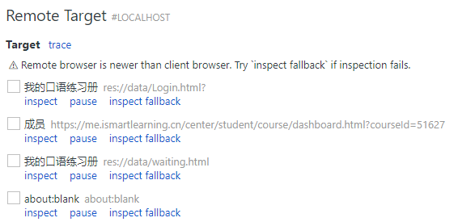
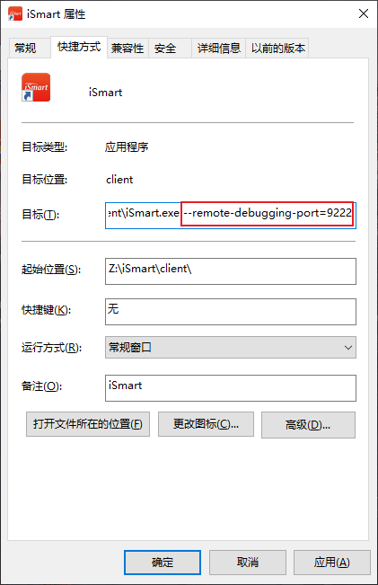

## iSmart 课程自动姬 v1.0.0

> 
<b>「不止于自动化，追求极致效率」</b>
 
> 
> * 如果你觉得这个脚本好用，请点一个 Star⭐，你的 Star 就是作者更新最大的动力

### 效果展示

* 拥有更好的题型适应性，理论上适配所有客观题种类
  
* 提升稳定性，中途宕机概率大大降低

* 采用全新思路，相较 [自动化方案](https://github.com/Mufanc/iSmartAuto) ，效率提升超过 1000%

 

### 工作原理

&emsp;&emsp;使用抓包工具分析客户端流量，可以得知 iSmart 客户端采用的判题方式为本地评判。也就是说会首先将题目和答案一同下载下来，完成答题后使用用户的计算机完成判分，最后将分数回传。这样一来就为爬取答案提供了可能，脚本会根据提供的用户名和密码完成登录，然后将习题的答案下载下来，为进一步地自动答题做好准备。

&emsp;&emsp;一次偶然的机会，我发现 iSmart 客户端其实就是一个套壳的 Chromium，在其启动参数中加上 `--remote-debugging-port=9222` 参数后，其中页面便能够在 [chrome://inspect](chrome://inspect) 中被调试：

&emsp;&emsp;进而，可以通过 Python 调用 [Chrome DevTools Protocol](https://chromedevtools.github.io/devtools-protocol/) （cdp），完成答案的自动提交

#### Q&A

* **Q：** 既然是回传分数，那为何不用 Python 直接将分数上报，反而要走 cdp？

> 上报分数的请求中有疑似 Hash 的字段 `ut`，且生成 `ut` 的方法 native，无法通过分析 JavaScript 得到（有木有大佬会 ollydbg 的来交个 PR）

 

* **Q：** 使用这个脚本，会不会被检测到作弊？

> 不排除这样的可能性，相较自动化而言，目前的方式提交的数据尚不完整（但成绩和学习时长会被记录），若是仔细比对，有可能会发现数据异常

### 使用方法

&emsp;&emsp;修改 `configs.yml` 中的账号和密码，保证与 iSmart 客户端中登录的账号一致，然后修改 iSmart 的启动快捷方式，增加参数 `--remote-debugging-port=9222`：

&emsp;&emsp;此时运行 main.py，启动 iSmart 客户端，进入某本书籍的教材学习页（如下图），脚本会自动提交成绩。

### 开发者的话

&emsp;&emsp;该项目尚处于起步阶段，项目结构还没有完全确定下来，所以后续可能会经历多次重构。目前很多功能虽然存在于源码中，但还不完善或者未经测试，可能造成意料之外的结果，所以在使用前还请三思
