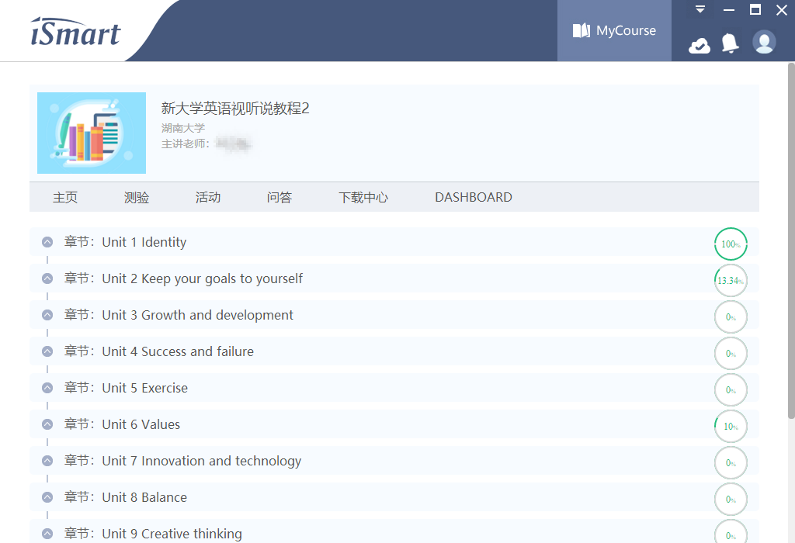

## iSmart 课程自动姬 v1.0.2

> <div align="center"><b>「不止于自动化，追求极致效率」</b></div><br/>
> 
> * 如果你觉得这个脚本好用，请点一个 Star⭐，你的 Star 就是作者更新最大的动力

### 效果展示

* 拥有更好的题型适应性，理论上适配所有客观题种类
  
* 提升稳定性，中途宕机概率大大降低

* 采用全新思路，相较 [自动化方案](https://github.com/Mufanc/iSmartAuto) ，效率提升超过 1000%


 

### 工作原理

&emsp;&emsp;使用抓包工具分析客户端流量，可以得知 iSmart 客户端采用的判题方式为本地评判。也就是说会首先将题目和答案一同下载下来，完成答题后使用用户的计算机完成判分，最后将分数回传。这样一来就为爬取答案提供了可能，脚本会根据提供的用户名和密码完成登录，然后将习题的答案下载下来，为进一步地自动答题做好准备。

&emsp;&emsp;一次偶然的机会，我发现 iSmart 客户端其实就是一个套壳的 Chromium，在其启动参数中加上 `--remote-debugging-port=9222` 参数后，其中页面便能够在 [chrome://inspect](chrome://inspect) 中被调试：


&emsp;&emsp;进而，可以通过 Python 调用 [Chrome DevTools Protocol](https://chromedevtools.github.io/devtools-protocol/) （cdp），完成答案的自动提交

#### Q&A

* **Q：** 既然是回传分数，那为何不用 Python 直接将分数上报，反而要走 cdp？

> &emsp;&emsp;上报分数的请求中有疑似 Hash 的字段 `ut`，且生成 `ut` 的方法 native，无法通过分析 JavaScript 得到（有木有大佬会 ollydbg 的来交个 PR）

<br/>

* **Q：** 使用这个脚本，会不会被检测到作弊？

> &emsp;&emsp;不排除这样的可能性，相较自动化而言，目前的方式提交的数据尚不完整（但成绩和学习时长会被记录），若是仔细比对，有可能会发现数据异常

### 使用方法

&emsp;&emsp;修改 iSmart 的启动快捷方式，增加参数 `--remote-debugging-port=9222`（如下图），**然后启动 iSmart 客户端并保持登录**


&emsp;&emsp;修改 `configs.yml` 中的账号和密码，保证与 iSmart 客户端中登录的账号一致，然后根据需要调整下方参数。在终端中执行 `py main.py -h` 可以查看更多帮助信息，这里列举几个常用命令

* 列出所有课程和书籍的详细信息

```shell
py main.py list -d
```

<br/>

* 根据书籍 id 执行刷课

```shell
py main.py flash -i 51627#7B6911511DB6B33638F6C58531D8FBD3
```

<br/>

* 根据当前打开的页面执行刷课

```shell
py main.py flash -c
```

注意如果打开的是「教材学习」页（如下图），只会刷打开的这一本书籍的任务



而如果是在课程详情页面，则会对该课程下的所有书籍执行刷课：


### 过滤器语法

* 待完善