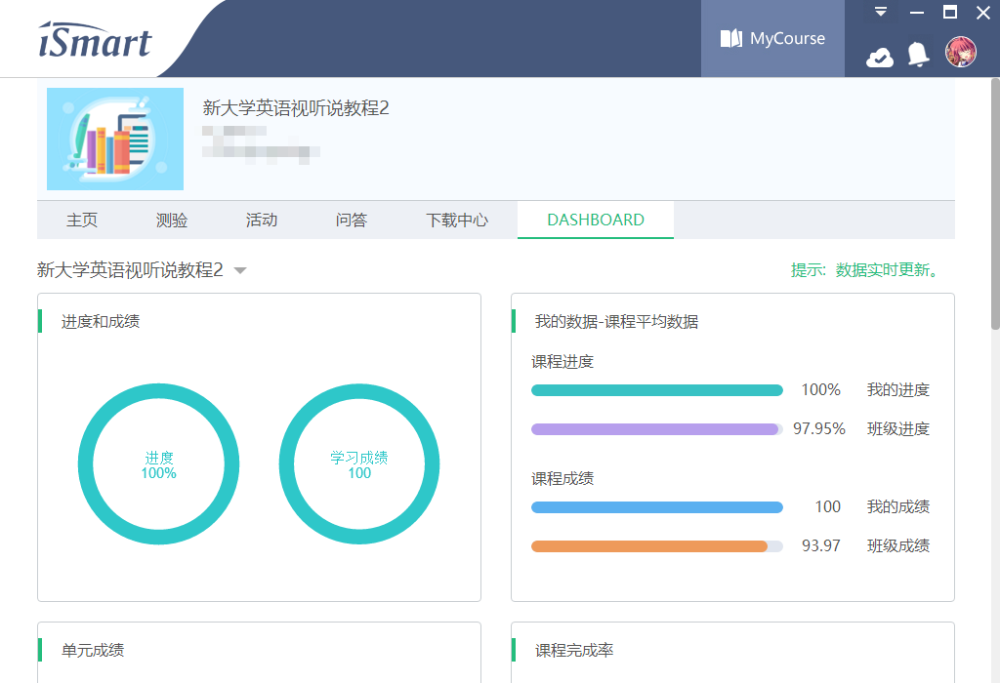
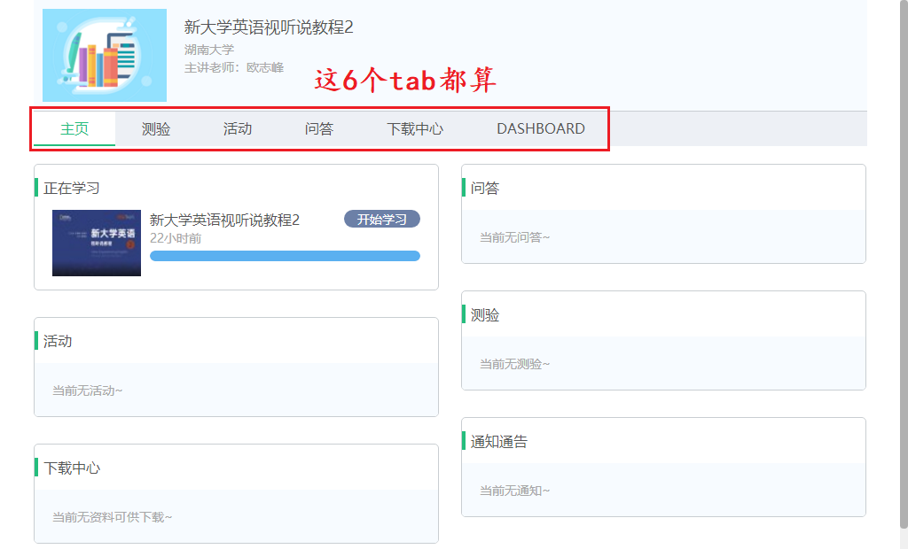

## iSmart 课程自动姬

* **强烈建议您在一个新的虚拟环境中运行此脚本，能有效规避一些因依赖版本不正确导致的问题**

### 效果展示



### 工作原理

&emsp;&emsp;使用抓包工具分析客户端流量，可以得知 iSmart 客户端采用的判题方式为本地评判。也就是说会首先将题目和答案一同下载下来，完成答题后使用用户的计算机完成判分，最后将分数回传。这样一来就为爬取答案提供了可能，脚本会根据提供的用户名和密码完成登录，然后将习题的答案下载下来，为进一步地自动答题做好准备。

&emsp;&emsp;一次偶然的机会，我发现 iSmart 客户端其实就是一个套壳的 Chromium，在其启动参数中加上 `--remote-debugging-port=9222` 参数后，其中页面便能够在 [chrome://inspect](chrome://inspect) 中被调试：


&emsp;&emsp;进而，可以通过 Python 调用 [Chrome DevTools Protocol](https://chromedevtools.github.io/devtools-protocol/) （cdp），完成答案的自动提交

&emsp;&emsp;实现细节已上传至[个人博客](https://blog.mufanc.xyz/posts/3824/)

#### Q&A

* **Q：** 既然是回传分数，那为何不用 Python 直接将分数上报，反而要走 cdp？

> &emsp;&emsp;上报分数的请求中有疑似 Hash 的字段 `ut`，且生成 `ut` 的方法 native，无法通过分析 JavaScript 得到（有木有大佬会 ollydbg 的来交个 PR）

<br/>

* **Q：** 使用这个脚本，会不会被检测到作弊？

> &emsp;&emsp;**后端似乎已有针对异常数据的检测手段，如果你无法接受数据异常可能带来的后果，请不要使用这个脚本**

### 使用方法

#### 下载源代码

&emsp;&emsp;在合适的位置打开终端，然后执行：

```shell
git clone https://github.com/Mufanc/iSmartAuto.git
cd iSmartAuto
```

&emsp;&emsp;如果你是直接下载的源码压缩包，那么直接在解压后的文件夹内打开终端

#### 安装依赖

&emsp;&emsp;在刚刚打开的终端中执行：

```shell
pip install -r requirements.txt
```

#### 配置 iSmart 客户端

&emsp;&emsp;修改 iSmart 的启动快捷方式，增加参数 `--remote-debugging-port=9222`（如下图），**然后启动 iSmart 客户端并保持登录**


#### 配置运行参数

&emsp;&emsp;修改 `configs.yml` 中的账号和密码，保证与 iSmart 客户端中登录的账号一致，然后根据需要调整下方参数。在终端中执行 `py main.py -h` 可以查看更多帮助信息，这里列举几个常用命令

* 列出所有课程和书籍的详细信息

```shell
python main.py -v list -d
```

<br/>

* 根据书籍 id 执行刷课

```shell
python main.py -v flash -i 51627-7B6911511DB6B33638F6C58531D8FBD3
```

<br/>

- 根据当前打开的页面执行刷课

```shell
python main.py -v flash -c
```

注意如果打开的是「教材学习」页（如下图），只会刷打开的这一本书籍的任务


而如果是在课程详情页面，则会对该课程下的所有书籍执行刷课：



### 「用户名密码错误」？

&emsp;&emsp;检查你的 `configs.yml` 中帐号密码格式是否正确，它应该不包含两边的尖括号，例如：

```yaml
# 用户配置（务必保持账号密码与 iSmart 中已登录的相同）
user:
  username: Mufanc
  password: 123456abcdef
```

### 「父节点不存在」？

&emsp;&emsp;由于教材差异，如果你的课程在客户端学习正常，而使用脚本刷课时每个单元都报「父节点不存在」，那么可以将 `spider.py` 119-128 行改成以下内容：

```python
for task_id in id_record:
    root.child.append(id_record[task_id])
```

&emsp;&emsp;将所有任务点直接挂到根节点上

### 为何关闭 issues

&emsp;&emsp;首先，我要贴上这个：[提问的艺术](https://github.com/betaseeker/How-To-Ask-Questions)

&emsp;&emsp;这个项目开发者和朋友们一直都有在使用，所以整体上大抵是不会有很严重的问题的，如果出现诸如「No module named 'xxxxx'」这类离谱的错误，我不可能会注意不到。如果在使用过程中遇到问题，第一选择应该是重新阅读 README 文档，看看有没有漏掉一些步骤或是环境不对，很多问题通过在搜索引擎中简单搜索，就能找到答案，完全没有必要跑过来询问开发者。

&emsp;&emsp;另一方面，一些人发问的方式令我难以回答，开发者在修复一个 bug 之前，首先需要能够稳定复现并且定位到问题所在，单凭一两行简单的描述和报错截图的信息往往是不够完成这一切的。对于不同的教材，可能会在少数几个参数上与我所使用的教材不同，导致脚本无法正常使用，而我又没有时间精力去要来每一个遇到问题的小伙伴的帐号并为他们单步调试，或者有些小伙伴会不放心把帐号交给我这个素未谋面的作者。凡此种种，造成了我很难在 issues 中有效地解决问题。

&emsp;&emsp;对于教材差异导致的脚本无法正常使用的问题，如果你有一定的开发能力，恰好又会抓包，完全可以对你的 iSmart 客户端进行抓包，然后简单修改几个参数来让脚本恢复正常，我相信你所需要修改的代码行数不会超过 20 行。举个简单的例子，有很多小伙伴的教材 BookType 不是 0，那么你只需要修改 [这个地方](https://github.com/Mufanc/iSmartAuto/blob/master/automaton/spider/spider.py#L193)，把 BookType 改成你的教材使用的数值即可（一般是 0, 1, 2, 3）；又或者，假如有一天登录寄了，你应该能能够注意到我在 [这里](https://github.com/Mufanc/iSmartAuto2/blob/master/automaton/spider/spider.py#L41) 硬编码了一段 salt，那么就去网页端看看这个 salt 是不是变了，将其修改成正确的值即可

&emsp;&emsp;思索再三，我决定关闭 issues 板块，如果有任何问题，可以到 [discussions](https://github.com/Mufanc/iSmartAuto/discussions) 中提出你的疑问，并寻找有没有使用同样教材的小伙伴。如果我有时间，也有可能会尝试复现你的问题并给出答复
